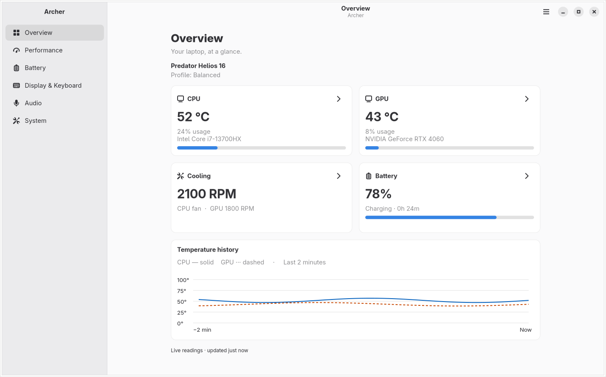

# Archer control center

Archer uses a native GTK4/libadwaita interface with six main destinations. The sidebar becomes an overlay on narrow windows; Display, Keyboard, Firmware, and Advanced open as subpages with a Back action.

| Destination | What you can do |
| --- | --- |
| Overview | Read live CPU/GPU, cooling and battery summaries; follow links to controls; inspect two minutes of temperature history. |
| Performance | Select a thermal profile, apply automatic/maximum/manual fan settings, and enable Game Mode. |
| Battery | Check charge and remaining time, protect charging at 80%, calibrate, and configure off-state USB charging. |
| Display & Keyboard | Configure graphics mode and panel response, preview zone colors, apply effects, and set backlight timeout. |

Zone colours and effects reach the keyboard through the ENE K5130 controller when it is available, falling back to the sysfs/WMI path otherwise; the effect list matches the modes verified on that controller. See [the protocol notes](ENE_PROTOCOL.md).
| Audio | Enable microphone noise suppression and find the virtual input in your applications. |
| System | Copy device information, change startup sound, check firmware, and access Advanced recovery tools. |

## Preview

The following screenshots use a simulated device; they do not show readings from the host laptop.

<picture>
  <source media="(prefers-color-scheme: dark)" srcset="screenshots/overview-dark.png">
  
</picture>

[Light appearance](screenshots/overview-light.png) · [Dark appearance](screenshots/overview-dark.png)

## Appearance and accessibility

The default **System** color scheme follows desktop light/dark preferences. The menu’s **Preferences** dialog also offers Light and Dark overrides. High contrast and supported desktop accent colors apply independently. Charts follow the same appearance and distinguish CPU/GPU with solid/dashed lines. Keyboard colors represent the selected hardware colors rather than the application theme.

This integration uses preferences exposed to libadwaita, normally through the desktop settings portal. It does not reproduce arbitrary GTK or Qt theme packages. A desktop that does not expose a preference receives the native libadwaita default.

GTK 4.12 and libadwaita 1.6 or later are required. System fonts and scaling are inherited; reduced-animation settings are respected. All controls have keyboard navigation and visible focus. Unavailable hardware controls are explained rather than represented as working controls or zero readings.

| Shortcut | Action |
| --- | --- |
| Ctrl+Q | Quit Archer |
| Ctrl+, | Preferences |
| Alt+Left | Return from a subpage |
| Escape | Dismiss navigation or a dialog |
| Tab / Shift+Tab | Move focus |
| Space / Enter | Activate the focused control |

## Saving and recovery

Switches and performance profiles apply immediately. Multi-field fan, graphics, and lighting edits use Apply and Reset. Drafts survive navigation, telemetry updates, and appearance changes. Reset restores the latest confirmed settings. Full exit asks before discarding drafts; hiding to the tray preserves them.

While a change is pending, its control group is disabled. Failed switches revert, failed staged edits remain editable, and an inline message explains the error. A timed-out write is reconciled with the service before another write is allowed. Offline/stale service state disables hardware writes and offers retry while retaining readable last-known information.

Graphics settings are labeled **Configured mode**. A successful change records a restart requirement for the current boot; it survives GUI/service restarts and clears after reboot. Archer does not reboot automatically. Firmware checks are advisory and explicit; failed checks never report that firmware is current.

Advanced’s model overrides are explicitly persistent. The previous duplicate “one-time” controls actually wrote the persistent configuration and have been removed. Existing custom fan curves remain visible as active; applying another fan mode stops curve control first. This UI does not add a new curve editor.

Closing hides the window only when a system tray host is available and the preference is enabled. Without a tray host it exits normally. If the tray disappears while the window is hidden, Archer presents the window again. Quit always exits.

Appearance, window geometry, and tray behavior are stored in `$XDG_CONFIG_HOME/archer/gui.json` (normally `~/.config/archer/gui.json`). Hardware settings remain in `/etc/archer/settings.json` and continue to use D-Bus/polkit authorization.

## System tray

Right-click Archer's tray icon to open this menu:

```text
Open
Profile ▸ Eco
          Quiet
          Balanced
          Performance
          Turbo
Exit
```

**Open** presents the full control center. **Profile** shows supported choices only, with a radio mark on the service-confirmed profile. Labels match the Performance page: Eco maps to `low-power`, Performance to `balanced-performance`, and Turbo to `performance`. Quiet and Balanced use `quiet` and `balanced`.

Selecting a profile applies it immediately, even with the window hidden. The GUI and tray use the same save flow and stay synchronized. Profile changes are disabled while a save is pending or the service is offline/stale; Profile is disabled when thermal control is unavailable. Firmware/provider restrictions still apply. A rejected change opens the Performance page with the error and retains the confirmed selection.

**Exit** quits the GUI process and removes its tray icon. If unapplied edits exist, Archer presents the existing discard confirmation first. The separate system daemon remains running to manage hardware; quitting the GUI does not stop the system service.

The panel must provide a StatusNotifierItem host with D-Bus menu support. Archer exports its menu through the standard [StatusNotifierItem Menu property](https://specifications.freedesktop.org/status-notifier-item/latest/status-notifier-item.html) and [D-Bus menu layout](https://cgit.arctica-project.org/libdbusmenu/tree/libdbusmenu-glib/dbus-menu.xml). Tray availability depends on the desktop/panel configuration. Without a host, the window remains the way to access Archer and closing it exits normally.

## Development and verification

The shared `AppState` handles settings, telemetry, connection recovery, and stale reads. Native `Form` groups guard programmatic updates, preserve drafts, and standardize asynchronous actions. The tray reuses the Performance form, publishes supported profiles and state updates, and serves recursive D-Bus menu layouts with stable item IDs. Existing daemon D-Bus method signatures are retained; sensor validity, boot-scoped graphics restart state, and firmware-check metadata extend the existing JSON payloads.

Run the hardware-free suites:

```sh
python tests/gui_contract_test.py
xvfb-run -a dbus-run-session -- python tests/gui_test.py
xvfb-run -a dbus-run-session -- python tests/gui_test.py --capture
xvfb-run -a dbus-run-session -- python tests/gui_test.py --capture --high-contrast
xvfb-run -a dbus-run-session -- python tests/gui_test.py --capture --large-text
dbus-run-session -- python tests/dbus_smoke.py
```

The capture runs render all views in light and dark at 360×600, 768×700, 1100×760 and 1440×900, check layout bounds, and write PNGs to `/tmp/archer-ui-review`. The simulated device data is isolated from real hardware. CI runs against Arch’s GTK runtime and uploads the images for review.

Before a release, complete these environment-dependent checks on real systems:

- GNOME, KDE, and a Wayland compositor: live desktop light/dark, accent and high-contrast changes; settings-portal availability; scaling; keyboard and screen-reader navigation.
- Tray registration, right-click Open/Profile/Exit, checked profile updates from both the GUI and tray, selection while hidden, tray-host disappearance and recovery, close-to-tray preference, and dirty-edit confirmation.
- Supported Acer hardware: polkit acceptance/cancellation, fan modes and active-curve transitions, AC/battery changes, calibration, graphics mode/reboot persistence, and audio restart behavior.
- Firmware errors, slow checks, and available updates against the installed fwupd version.

Automated UI tests and screenshots validate simulated interactions; they do not establish physical hardware compatibility or replace the desktop matrix above.
